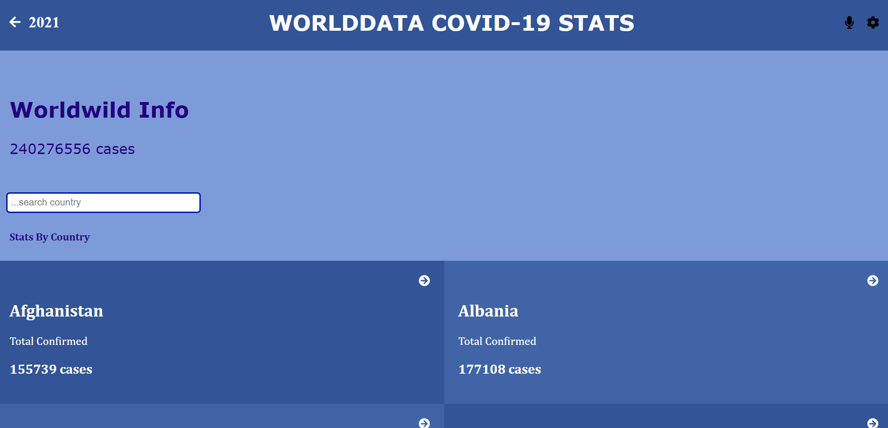
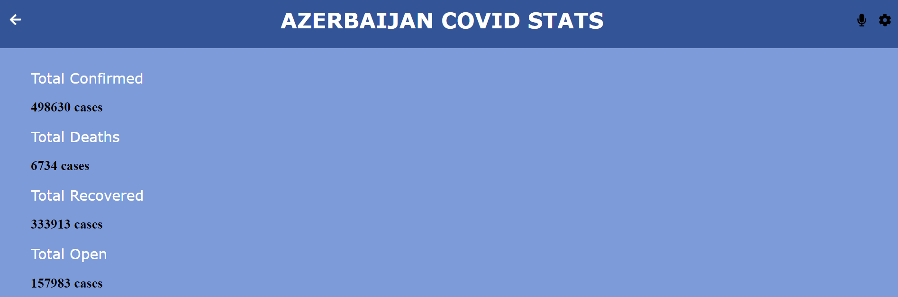
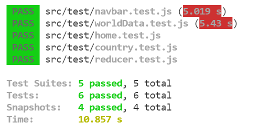

# <b>COVİD-19 METRICS</b>
## <b>This is a capstone project in React Module</b>
### <i>The project is about building a mobile web application to check a list of Worldwide COVID-19 metrics (numeric values). By clicking on country name, there is a posibility to view more detail information.</i>
 

## The project deployed on [Netlify](https://www.netlify.com/).  <b>Check deployed [demo](https://elmar-project-covid19.netlify.app/).</b>
 

## Project screenshots:

### Country list page:

### Country detail page:

## Tested with React Renderer
### Test results screenshot:

# Built With
- ReactJS
- Redux
- JS 
- CSS
- Node.js
- Netlify

# Getting Started

## Setup
- git clone https://github.com/elmar8287/metrics.git
- cd ./metrics

## Install
npm install

## Usage
npm start

## Build
npm run build

## Run tests
npm test

## Author

👤 **Elmar Abdulkarimov**

- GitHub: [Elmar Abdulkarimov](https://github.com/elmar8287)

## 🤝 Contributing

Contributions, issues, and feature requests are welcome!

Feel free to check the [issues page](../../issues/).

## Show your support

Give a ⭐️ if you like this project!

## Acknowledgments

The original design of this project is by Nelson Sakwa. You can view by link below: https://www.behance.net/gallery/31579789/Ballhead-App-%28Free-PSDs%29

## 📝 License

This project is [MIT](./MIT.md) licensed.
